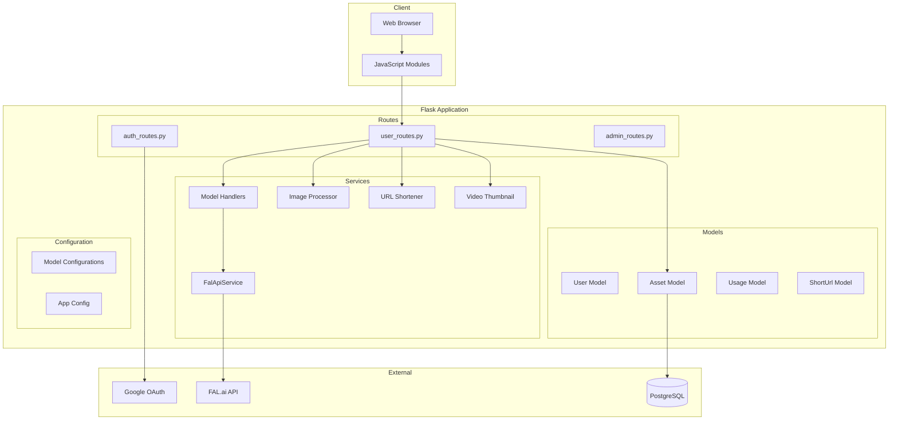
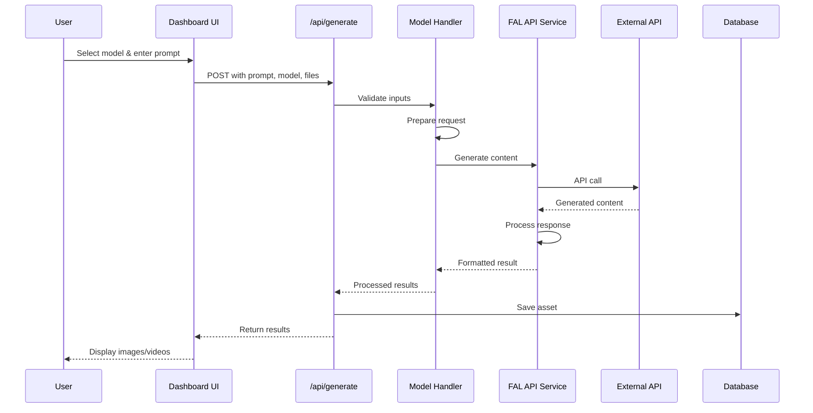
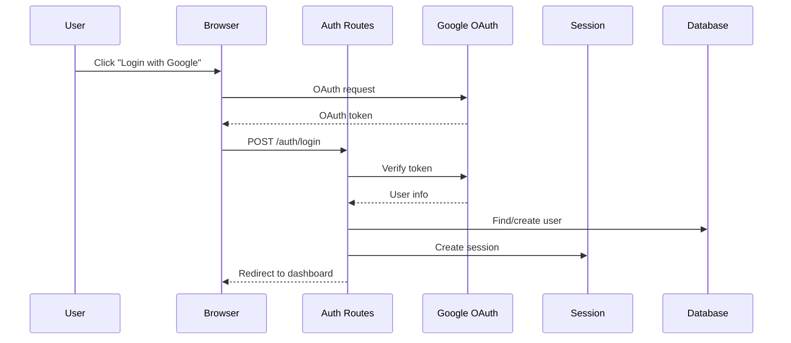
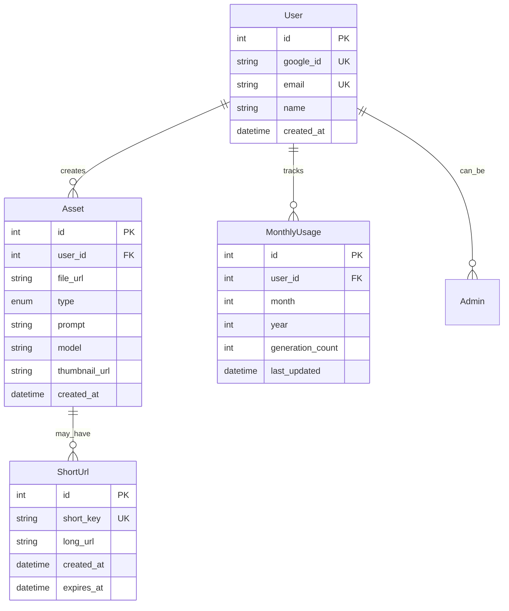

# AI Image Generator - Architecture Documentation

## Overview

The AI Image Generator is a Flask-based web application that provides a unified interface for multiple AI image and video generation models. It follows a layered architecture pattern with clear separation of concerns.

## System Architecture

### High-Level Architecture

```
┌─────────────────────────────────────────────────────┐
│                   Client Layer                       │
│         (Browser, Mobile App, API Client)            │
└─────────────────────────────────────────────────────┘
                          │
                          ▼
┌─────────────────────────────────────────────────────┐
│                Presentation Layer                    │
│    (Routes, Templates, Static Files, JavaScript)    │
├─────────────────────────────────────────────────────┤
│                Business Logic Layer                  │
│      (Services, Handlers, Processors, Utils)        │
├─────────────────────────────────────────────────────┤
│                Data Access Layer                     │
│        (SQLAlchemy Models, Database, Cache)         │
├─────────────────────────────────────────────────────┤
│               External Services Layer                │
│          (FAL.ai API, Google Auth, Storage)         │
└─────────────────────────────────────────────────────┘
```

### Component Architecture



## Data Flow

### Image Generation Flow



### Authentication Flow



## Directory Structure

```
ai-image-generator/
├── app/                        # Main application package
│   ├── __init__.py            # Flask app factory
│   ├── models/                # Database models
│   │   └── models.py          # SQLAlchemy models
│   ├── routes/                # HTTP endpoints
│   │   ├── auth_routes.py     # Authentication
│   │   ├── user_routes.py     # User features
│   │   └── admin_routes.py    # Admin panel
│   ├── services/              # Business logic
│   │   ├── fal_api.py        # External API integration
│   │   ├── models_config.py   # Model configurations
│   │   ├── model_handlers.py  # Request/response handlers
│   │   ├── image_processor.py # Image manipulation
│   │   ├── url_shortener.py   # URL shortening
│   │   └── video_thumbnail.py # Thumbnail generation
│   ├── static/                # Static assets
│   │   ├── css/              # Stylesheets
│   │   ├── js/               # JavaScript
│   │   └── generated/        # Generated content
│   ├── templates/            # Jinja2 templates
│   └── utils/                # Utility modules
├── migrations/               # Database migrations
├── docs/                     # Documentation
├── scripts/                  # Utility scripts
├── config.py                # Configuration
├── run.py                   # Application entry point
└── requirements.txt         # Dependencies
```

## Key Components

### 1. Model Configuration System

The model configuration system (`models_config.py`) centralizes all model-specific behaviors:

```python
MODEL_CONFIGURATIONS = {
    'model_id': {
        'name': 'Display Name',
        'endpoint': 'api/endpoint',
        'type': 'model_type',
        'ui_config': {...},      # UI behavior
        'validation': {...},     # Input validation
        'default_params': {...}  # API parameters
    }
}
```

### 2. Model Handlers

Handlers provide a uniform interface for different model types:

- **BaseHandler**: Abstract base class
- **TextToImageHandler**: Standard image generation
- **ImageToVideoHandler**: Video generation
- **InpaintingHandler**: Mask-based editing

### 3. Service Layer

Services encapsulate business logic:

- **FalApiService**: Manages API communication
- **ImageProcessor**: Handles image operations
- **URLShortener**: Creates short URLs for long video links
- **VideoThumbnailService**: Generates video thumbnails
- **UsageTracker**: Monitors user quotas

### 4. Database Models



## Security Architecture

### Authentication & Authorization

1. **Google OAuth 2.0** for user authentication
2. **Session-based** authentication with Flask-Session
3. **Role-based** access control (User/Admin)

### Security Measures

- CSRF protection via secure sessions
- Input validation at multiple layers
- File type and size restrictions
- Rate limiting per user
- Secure cookie handling

## Deployment Architecture

### Local Development

```
Flask Development Server
    ├── SQLite Database
    ├── Filesystem Sessions
    └── Local File Storage
```

### Production (Heroku)

```
Gunicorn WSGI Server
    ├── PostgreSQL Database
    ├── Redis Sessions (optional)
    └── Ephemeral File Storage
```

### Production (PythonAnywhere)

```
WSGI Application
    ├── PostgreSQL Database
    ├── Filesystem Sessions
    └── Persistent File Storage
```

## Performance Considerations

### Caching Strategy

1. **URL Cache**: In-memory cache for shortened URLs
2. **Static Assets**: Browser caching headers
3. **Database Queries**: Connection pooling

### Optimization Points

1. **Image Processing**: Resize before API calls
2. **Parallel Requests**: Multiple outputs generated concurrently
3. **Lazy Loading**: Assets loaded on demand in library

## Monitoring & Logging

### Logging Strategy

```python
logger.info()     # Normal operations
logger.warning()  # Recoverable issues
logger.error()    # Errors requiring attention
logger.exception() # Errors with stack traces
```

### Key Metrics

1. **API Response Times**: Track external API performance
2. **Generation Success Rate**: Monitor failures
3. **Usage Patterns**: Track popular models
4. **Error Rates**: Identify problematic areas

## Scalability Considerations

### Horizontal Scaling

- Stateless application design
- External session storage (Redis)
- Database connection pooling
- Load balancer ready

### Vertical Scaling

- Async task queue for long operations
- Efficient image processing
- Optimized database queries
- Resource usage monitoring

## Future Architecture Improvements

1. **Microservices**: Separate API gateway, generation service
2. **Message Queue**: Async processing with Celery/RabbitMQ
3. **CDN Integration**: Serve generated content via CDN
4. **API Versioning**: Support multiple API versions
5. **GraphQL**: Alternative to REST API
6. **WebSocket**: Real-time generation updates

## Development Workflow

### Local Development

```bash
# Setup
python -m venv venv
source venv/bin/activate
pip install -r requirements.txt

# Database
flask db upgrade

# Run
python run.py
```

### Testing

```bash
# Unit tests
pytest tests/

# Integration tests
pytest tests/integration/

# Load tests
locust -f tests/load/
```

### Deployment

```bash
# Heroku
git push heroku main

# PythonAnywhere
git pull
python -m pip install -r requirements.txt
touch /var/www/username_pythonanywhere_com_wsgi.py
``` 