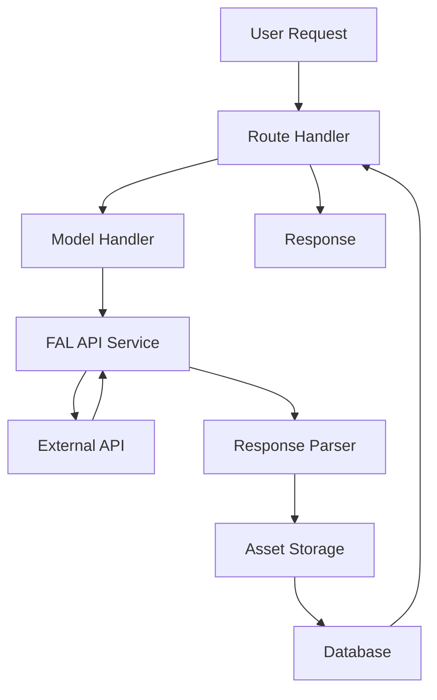

# AI Image Generator - Refactoring Plan

## Overview
This document outlines a comprehensive refactoring plan to improve code maintainability, reduce file sizes, and enhance AI-assisted development capabilities.

## Priority 1: Breaking Down Large Files

### 1. `app/services/fal_api.py` (918 lines → ~200 lines each)

**Current Issues:**
- Handles multiple API integration methods
- Contains image processing logic
- Manages URL shortening
- Complex error handling spread throughout

**Proposed Structure:**
```
app/services/fal/
├── __init__.py           # Export FalApiService
├── base.py              # Base service class
├── rest_client.py       # REST API implementation
├── client_wrapper.py    # fal_client library wrapper
├── image_utils.py       # Image processing utilities
└── response_parser.py   # Response parsing and formatting
```

**Refactoring Steps:**
1. Extract REST API logic to `rest_client.py`
2. Move fal_client wrapper to `client_wrapper.py`
3. Separate image processing to `image_utils.py`
4. Create response parser for consistent output handling

### 2. `app/routes/user_routes.py` (541 lines → ~150 lines each)

**Current Issues:**
- Too many endpoints in one file
- Mixed concerns (generation, library, assets)
- Complex request handling logic

**Proposed Structure:**
```
app/routes/user/
├── __init__.py          # Register all user blueprints
├── generation.py        # /api/generate endpoints
├── library.py          # /library, /asset endpoints
├── dashboard.py        # /dashboard, main UI
└── api.py             # Other API endpoints
```

**Refactoring Steps:**
1. Group related endpoints together
2. Extract shared logic to utility functions
3. Create separate blueprints for each module
4. Consolidate error handling

### 3. `app/services/models_config.py` (552 lines → ~200 lines each)

**Current Issues:**
- All model configurations in one file
- Mixing configuration data with helper functions

**Proposed Structure:**
```
app/services/models/
├── __init__.py          # Export configurations
├── config_base.py       # Base configuration classes
├── text_to_image.py     # Text-to-image model configs
├── video_models.py      # Video generation configs
├── inpainting.py        # Inpainting model configs
└── helpers.py          # Configuration helper functions
```

### 4. `app/services/model_handlers.py` (513 lines → ~150 lines each)

**Proposed Structure:**
```
app/services/handlers/
├── __init__.py          # Export handler registry
├── base.py             # BaseHandler abstract class
├── text_to_image.py    # TextToImageHandler
├── image_to_video.py   # ImageToVideoHandler
├── inpainting.py       # InpaintingHandler
└── registry.py         # HandlerRegistry class
```

### 5. `app/__init__.py` (256 lines → ~100 lines)

**Proposed Structure:**
```
app/
├── __init__.py         # Simplified app factory
├── extensions.py       # Extension initialization
├── config_loader.py    # Configuration loading
├── db_setup.py        # Database configuration
└── compatibility.py    # Python version fixes
```

## Priority 2: Documentation Improvements

### 1. Add Comprehensive Type Hints

**Example transformation:**
```python
# Before
def generate_image(prompt, model, image_file=None):
    """Generate an image"""
    pass

# After
from typing import Optional, Dict, Any, Union
from werkzeug.datastructures import FileStorage

def generate_image(
    prompt: str,
    model: Dict[str, Any],
    image_file: Optional[FileStorage] = None
) -> Dict[str, Union[str, int]]:
    """
    Generate an image using the specified model.
    
    Args:
        prompt: Text description for image generation
        model: Model configuration dictionary containing endpoint and params
        image_file: Optional reference image for img2img models
        
    Returns:
        Dictionary containing:
        - 'url': Generated image URL
        - 'id': Database asset ID
        
    Raises:
        ValueError: If prompt is empty or model is invalid
        APIError: If generation fails
    """
    pass
```

### 2. API Documentation

Create `docs/api-reference.md`:
```markdown
# API Reference

## Authentication Endpoints

### POST /auth/login
Login with Google OAuth or admin credentials.

**Request Body:**
```json
{
  "credential": "google_oauth_token",
  // OR
  "username": "admin_username",
  "password": "admin_password"
}
```

**Response:**
```json
{
  "success": true,
  "redirect_url": "/dashboard"
}
```

## Generation Endpoints

### POST /api/generate
Generate images or videos using AI models.

**Request:**
- Method: POST
- Content-Type: multipart/form-data

**Parameters:**
| Name | Type | Required | Description |
|------|------|----------|-------------|
| prompt | string | Yes* | Text description |
| model | string | Yes | Model ID |
| image | file | No* | Reference image |
| mask | file | No* | Mask for inpainting |

*Requirements vary by model type
```

### 3. Architecture Documentation

Create `docs/architecture.md`:
```markdown
# Architecture Overview

## Layered Architecture

```
┌─────────────────────────────────────┐
│          Presentation Layer          │
│  (Templates, Static Files, Routes)   │
├─────────────────────────────────────┤
│         Business Logic Layer         │
│   (Services, Handlers, Processors)   │
├─────────────────────────────────────┤
│          Data Access Layer           │
│      (Models, Database, Cache)       │
├─────────────────────────────────────┤
│         External Services            │
│       (FAL.ai API, Storage)          │
└─────────────────────────────────────┘
```

## Component Relationships


```

## Priority 3: Code Quality Improvements

### 1. Extract Constants

Create `app/constants.py`:
```python
"""Application-wide constants."""

# File size limits
MAX_IMAGE_SIZE_MB = 10
MAX_VIDEO_SIZE_MB = 50

# API timeouts
DEFAULT_API_TIMEOUT = 60
VIDEO_API_TIMEOUT = 180

# Image processing
DEFAULT_IMAGE_SIZE = 1024
THUMBNAIL_SIZE = 256

# Rate limiting
MAX_REQUESTS_PER_HOUR = 100
MAX_GENERATIONS_PER_DAY = 50
```

### 2. Standardize Error Handling

Create `app/exceptions.py`:
```python
"""Custom exceptions for better error handling."""

class AppError(Exception):
    """Base application exception."""
    status_code = 500
    
class ValidationError(AppError):
    """Input validation failed."""
    status_code = 400
    
class APIError(AppError):
    """External API call failed."""
    status_code = 502
    
class RateLimitError(AppError):
    """Rate limit exceeded."""
    status_code = 429
```

### 3. Create Utility Modules

Create focused utility modules:
```
app/utils/
├── validation.py      # Input validation utilities
├── formatting.py      # Output formatting helpers
├── file_handling.py   # File operations
└── api_helpers.py     # API request/response utilities
```

## Implementation Timeline

### Phase 1 (Week 1-2): Foundation
- [ ] Set up new directory structures
- [ ] Create base classes and interfaces
- [ ] Add comprehensive logging

### Phase 2 (Week 3-4): Core Refactoring
- [ ] Break down fal_api.py
- [ ] Refactor user_routes.py
- [ ] Split model configurations

### Phase 3 (Week 5-6): Documentation
- [ ] Add type hints throughout
- [ ] Create API documentation
- [ ] Update architecture docs

### Phase 4 (Week 7-8): Testing & Cleanup
- [ ] Add unit tests for refactored code
- [ ] Remove deprecated code
- [ ] Performance optimization

## Success Metrics

1. **File Size**: No file larger than 300 lines
2. **Documentation**: 100% of public methods documented
3. **Type Coverage**: 90%+ type hint coverage
4. **Test Coverage**: 80%+ unit test coverage
5. **Complexity**: Cyclomatic complexity < 10 per function

## Migration Strategy

1. **Gradual Migration**: Refactor one module at a time
2. **Backward Compatibility**: Maintain imports during transition
3. **Feature Flags**: Use flags to switch between old/new code
4. **Continuous Testing**: Run tests after each change

## Tools for Refactoring

1. **pylint**: Code quality checking
2. **mypy**: Type checking
3. **black**: Code formatting
4. **isort**: Import organization
5. **pytest**: Testing framework

## Notes for AI Assistants

When refactoring:
1. Preserve all existing functionality
2. Maintain consistent naming conventions
3. Add detailed docstrings with examples
4. Include type hints for all parameters
5. Create small, focused commits
6. Update imports across the codebase
7. Add tests for refactored code 